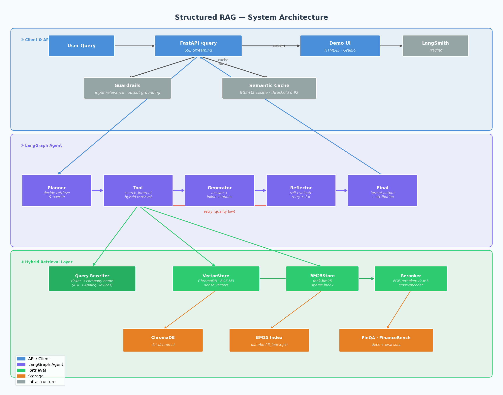

# Structured RAG — FinQA Agentic RAG System

An end-to-end **Agentic RAG** system for structured financial documents, built to demonstrate the full AI Engineer stack: hybrid retrieval, LangGraph agentic loop, reflection, observability, and cross-dataset evaluation.

## Evaluation Results

### FinQA (In-Domain)

Best configuration: `fixed chunking / chunk_size=512 / alpha=0.7 / candidate_k=40 / ticker-year header injection`

| Metric | Score |
|--------|-------|
| Hit@1 | 0.814 |
| Hit@3 | 0.940 |
| Hit@5 | **0.967** |
| MRR@5 | 0.878 |
| Faithfulness | **1.000** |
| Context Precision | 0.833 |
| Answer Relevancy | 0.890 |

Evaluated on 200 QA pairs (retrieval) + 50 samples (RAGAS), using FinQA eval.jsonl.

### FinanceBench (Cross-Domain Generalization)

Evaluated on [PatronusAI/financebench](https://huggingface.co/datasets/PatronusAI/financebench): 150 QA pairs across 84 financial documents (10-K/10-Q, 2022–2023).
Index built from official `evidence_text_full_page` annotations. No fine-tuning or domain adaptation.

| Metric | Score |
|--------|-------|
| Hit@1 | 0.627 |
| Hit@3 | 0.833 |
| Hit@5 | **0.907** |
| MRR@5 | 0.738 |
| Faithfulness | 0.733 |
| Context Precision | 0.409 |

**Cross-domain Hit@5 drop: 0.967 → 0.907 (−6%)**, demonstrating strong out-of-distribution generalization with zero adaptation.

### Mixed Evaluation (FinQA + FinanceBench)

Stratified mixed evaluation: 150 FinQA + 150 FinanceBench questions (300 total), evaluated against the combined retrieval pool (both corpora as hard negatives). Best configuration: `fixed chunking / chunk_size=1024`.

| Metric | Score |
|--------|-------|
| Hit@1 | 0.543 |
| Hit@3 | 0.733 |
| Hit@5 | **0.813** |
| MRR@5 | 0.647 |
| Faithfulness | 0.852 |
| Context Precision | 0.391 |
| Answer Relevancy | 0.513 |

Mixed evaluation uses a harder retrieval setup — all documents from both datasets remain in the retrieval pool, increasing the candidate space and making Hit@K metrics more conservative than single-dataset runs.

## Architecture



```
User Query
    ↓
[FastAPI /query]  ── SSE streaming ──→  [HTML/JS Demo UI]
    ↓
[Guardrails]      — block non-financial queries; check answer grounding
    ↓
[Semantic Cache]  — return cached result if cosine similarity > 0.92
    ↓
[LangGraph Agent]
    ├─ Planner Node    — decide whether to retrieve + whether to rewrite query
    ├─ Tool Node       — search_internal (hybrid retrieval + optional query rewriting)
    ├─ Generator Node  — produce answer with inline citations
    ├─ Reflector Node  — self-evaluate quality; retry ≤ 2 times
    └─ Final Node      — format output + source attribution
         ↓
[Hybrid Retriever]
    ├─ QueryRewriter   — expand ticker symbols to full company names (ADI → Analog Devices)
    ├─ VectorStore     — ChromaDB + BGE-M3 dense vectors
    ├─ BM25Store       — rank-bm25 sparse index
    └─ Reranker        — BGE-reranker-v2-m3 cross-encoder (uses original query)
```

## Tech Stack

| Area | Choice |
|------|--------|
| Embedding | BAAI/bge-m3 |
| Vector store | ChromaDB (cosine, persistent) |
| Sparse retrieval | rank-bm25 |
| Reranker | BAAI/bge-reranker-v2-m3 |
| Agent framework | LangGraph |
| LLM | Qwen3-8B (local via llama.cpp or ModelScope API) |
| Tracing | LangSmith |
| Evaluation | RAGAS + LLM-as-Judge + Hit@K/MRR |
| API | FastAPI + SSE streaming |
| Frontend | HTML/JS (served from FastAPI) |

## Project Structure

```
rag_demo/
├── config/
│   └── settings.yaml              # Central configuration
├── data/
│   ├── finqa/docs/                # FinQA source documents (.md)
│   ├── chroma/                    # ChromaDB persistent storage
│   ├── bm25_index.pkl             # BM25 index
│   ├── semantic_cache.pkl         # Semantic cache (persisted)
│   ├── doc_summaries.jsonl        # LLM-generated doc summaries
│   ├── eval_results.json          # Latest evaluation results
│   └── eval_log.jsonl             # Experiment comparison log
├── src/
│   ├── config.py                  # Config loader
│   ├── data_loader.py             # FinQA dataset downloader
│   ├── chunk_manager.py           # Text chunking (fixed/recursive/semantic)
│   ├── vector_store.py            # ChromaDB + BGE-M3 (ticker/year metadata)
│   ├── bm25_store.py              # BM25 sparse index
│   ├── reranker.py                # BGE cross-encoder reranker
│   ├── retriever.py               # Hybrid retrieval + semantic cache + query rewrite
│   ├── query_rewriter.py          # LLM-based ticker expansion (ADI → Analog Devices)
│   ├── semantic_cache.py          # Cosine similarity cache, persisted to pkl
│   ├── guardrails.py              # Input relevance check + output grounding check
│   ├── metadata_extractor.py      # ticker/year extraction for pre-filtering
│   ├── doc_metadata_extractor.py  # LLM-based metadata extraction for multi-source docs
│   ├── document_loader.py         # URL / PDF / Markdown loader
│   ├── doc_summarizer.py          # LLM batch doc summarization
│   ├── summary_store.py           # ChromaDB summary collection (2-stage retrieval)
│   ├── ingestion_registry.py      # Document ingestion tracker
│   ├── evaluator.py               # RAGAS + Hit@K/MRR batch evaluation
│   ├── llm_judge.py               # LLM-as-Judge per-query scoring
│   ├── agent/
│   │   ├── state.py               # LangGraph AgentState
│   │   ├── tools.py               # search_internal tool
│   │   ├── nodes.py               # 5 agent nodes + PlannerDecision structured output
│   │   └── graph.py               # LangGraph StateGraph
│   └── api/
│       ├── main.py                # FastAPI SSE endpoints + async ingestion
│       └── static/
│           └── index.html         # HTML/JS demo UI
└── scripts/
    ├── ingest_finqa.py            # Batch FinQA document ingestion (--force to re-ingest)
    ├── ingest_financebench.py     # FinanceBench ingestion (evidence_text_full_page)
    ├── merge_eval.py              # Merge FinQA + FinanceBench into mixed eval set
    ├── generate_financebench_qa.py # Convert FinanceBench dataset to eval format
    ├── generate_qa.py             # LLM-based QA pair generation
    ├── eval_retrieval.py          # Standalone retrieval evaluation
    ├── compare_evals.py           # Multi-run experiment comparison table
    └── eval_smoke.py              # CI smoke test (recall@5 ≥ 0.6)
```

## Quick Start

### 1. Install dependencies

```bash
pip install -r requirements.txt
```

### 2. Set environment variables

```bash
# ModelScope API (for cloud LLM)
export MODELSCOPE_API_KEY=your_api_key_here

# LangSmith tracing (configured — view traces at smith.langchain.com)
export LANGCHAIN_TRACING_V2=true
export LANGCHAIN_API_KEY=your_langsmith_key
export LANGCHAIN_PROJECT=rag-demo
```

### 3. Start local LLM (optional — or use ModelScope API)

```bash
# Build llama.cpp
git clone https://github.com/ggerganov/llama.cpp && cd llama.cpp
cmake -B build -DGGML_CUDA=ON -DCMAKE_CUDA_COMPILER=/usr/local/cuda/bin/nvcc
cmake --build build --config Release -j$(nproc)

# Start server (Qwen3-8B GGUF Q4_K_M)
./build/bin/llama-server \
    -m /path/to/Qwen3-8B-Q4_K_M.gguf \
    --n-gpu-layers -1 --ctx-size 8192 \
    --port 8000 --api-key local

# Update config/settings.yaml: base_url: "http://localhost:8000/v1"
```

### 4. Ingest documents

```bash
# FinQA
python src/data_loader.py
python scripts/ingest_finqa.py

# FinanceBench (no PDF download required)
python scripts/generate_financebench_qa.py
python scripts/ingest_financebench.py
```

### 5. Start the API + Demo UI

```bash
uvicorn src.api.main:app --host 0.0.0.0 --port 8080
# Open http://localhost:8080
```

## API Endpoints

| Method | Path | Description |
|--------|------|-------------|
| `GET` | `/` | HTML/JS demo UI |
| `GET` | `/health` | Liveness probe — returns ChromaDB chunk count + BM25 status |
| `POST` | `/query` | SSE streaming query (LangGraph agent) · rate limit 30/min |
| `POST` | `/ingest` | Async document ingestion → returns `job_id` · rate limit 10/min |
| `GET` | `/ingest/{job_id}` | Poll ingestion status and progress |

**Authentication**: set `RAG_API_KEY` env var to enable Bearer token auth. Unset = open (local dev).

```bash
export RAG_API_KEY=your-secret-key
curl -H "Authorization: Bearer your-secret-key" http://localhost:8080/query ...
```

**Logging**: structured JSON logs by default. Set `LOG_FORMAT=text` for human-readable output during development.

### Async Ingestion

```bash
# Submit ingestion job
curl -X POST http://localhost:8080/ingest \
  -H "Content-Type: application/json" \
  -d '{"doc_id": "AAPL_2023_page_1.pdf", "text": "..."}'
# → {"job_id": "a1b2c3d4", "status": "queued"}

# Poll status
curl http://localhost:8080/ingest/a1b2c3d4
# → {"status": "done", "progress": 12, "total": 12}
```

## Docker

```bash
echo "MODELSCOPE_API_KEY=your_key" > .env
docker compose up --build
```

## Evaluation

### RAGAS + Hit@K/MRR batch evaluation

```bash
# FinQA — 50 RAGAS samples + 200 retrieval samples
python src/evaluator.py --n 50 --n-retrieval 200 --tag baseline

# FinanceBench — 20 RAGAS samples + 150 retrieval samples
python src/evaluator.py --tag financebench_evidence \
  --eval-path data/results/financebench_qa.jsonl \
  --n 20 --n-retrieval 150

# Mixed (FinQA + FinanceBench) — 50 RAGAS samples + 300 retrieval samples
python scripts/merge_eval.py   # generates data/eval_mixed.jsonl
python src/evaluator.py --tag mixed_eval \
  --eval-path data/eval_mixed.jsonl \
  --n 50 --n-retrieval 300

# With query rewriting enabled
python src/evaluator.py --n 10 --n-retrieval 200 --tag rewrite --query-rewrite

# Compare multiple experiment runs
python scripts/compare_evals.py
```

Metrics tracked per run: `faithfulness`, `context_precision`, `answer_relevancy`, `hit@1/3/5`, `mrr@1/3/5`, per-phase latency, token counts.

### LLM-as-Judge

```bash
python src/llm_judge.py
```

### CI smoke test

Runs automatically on every push/PR via GitHub Actions (recall@5 threshold: 0.6).

```bash
python scripts/eval_smoke.py --n 10 --top-k 5 --threshold 0.6
```

## Configuration

Key settings in `config/settings.yaml`:

| Parameter | Value | Description |
|-----------|-------|-------------|
| `chunking.strategy` | `fixed` | `fixed` / `recursive` / `semantic` |
| `chunking.chunk_size` | `512` | Tokens per chunk |
| `retriever.mode` | `custom` | `custom` (BM25+dense) or `m3_hybrid` |
| `retriever.top_k` | `5` | Final top-k results |
| `retriever.custom.alpha` | `0.7` | Dense weight (1.0=pure dense, 0.0=pure BM25) |
| `retriever.custom.candidate_k` | `40` | Candidates before reranking |
| `semantic_cache.threshold` | `0.92` | Cosine similarity threshold for cache hit |
| `agent.max_retries` | `2` | Max reflection retries |
| `llm.base_url` | `http://localhost:8000/v1` | LLM endpoint (local or API) |

## Experiment Findings

| Experiment | Dataset | Hit@5 | Faithfulness | Notes |
|-----------|---------|-------|--------------|-------|
| baseline (alpha=0.4, ck=20) | FinQA | 0.500 | 0.750 | Starting point |
| alpha=0.7, candidate_k=40 | FinQA | 0.896 | 0.925 | +39.6% Hit@5 |
| recursive chunking (char-based) | FinQA | 0.710 | 0.763 | Bug: chunk_size was in chars not tokens → 5× smaller chunks |
| semantic chunking (unconstrained) | FinQA | 0.715 | 0.749 | Bug: min_chunk_size not set → over-splits short financial sentences |
| metadata pre-filter (ticker/year) | FinQA | 0.760 | 0.675 | Low ticker recall from query |
| summary-based 2-stage filter | FinQA | 0.754 | 0.775 | −32% retrieval time, lower Hit@5 |
| **ticker-year header injection** | **FinQA** | **0.967** | **1.000** | Largest single improvement |
| query rewriting (full) | FinQA | 0.967 | 1.000 | +8.7% Answer Relevancy, +68% retrieval latency |
| chunk_size=1024 | FinQA | 0.645 | 0.804 | Larger chunks hurt: context too coarse for reranker |
| **FinanceBench cross-domain** | FinanceBench | **0.907** | 0.733 | Zero-shot, −6% vs FinQA best |
| Mixed eval (fixed/1024) | Mixed | **0.813** | 0.852 | Both corpora in retrieval pool as hard negatives |

**Key insight — Header injection**: FinQA documents never mention ticker symbols in body text. Prepending `[TICKER | YEAR]` to every chunk at index time bridges the vocabulary gap for both BM25 and dense retrieval, yielding the largest single improvement (+8% Hit@5, +17.5% Faithfulness). Applied to both FinQA and FinanceBench at ingest time.

**Chunking unit bug**: `RecursiveCharacterTextSplitter` measures `chunk_size` in characters, while `TokenTextSplitter` (fixed strategy) uses tokens. Setting `chunk_size=512` produced 5× smaller chunks for recursive (avg 72 words vs 386 words). Fixed by switching to `from_tiktoken_encoder`. `SemanticChunker` does not accept `chunk_size` at all — fixed by setting `min_chunk_size=500` and `breakpoint_threshold_amount=95` to prevent over-splitting.

**Agentic query rewriting**: The Planner node uses structured output (`PlannerDecision`) to decide whether a query contains ticker symbols needing expansion. This avoids latency cost for queries that already use full company names, while gaining Answer Relevancy improvements for ticker-heavy queries.

**Cross-domain generalization**: Zero-shot evaluation on FinanceBench (2022–2023 10-K/10-Q) shows Hit@5 degrading only 6% from FinQA best (0.967 → 0.907), validating that the hybrid retrieval design generalizes across financial document sources without retraining.

**Mixed evaluation**: Stratified sampling (150 FinQA + 150 FinanceBench, seed=42) with the full combined retrieval pool. Hit@5 0.813 reflects a harder setting than single-dataset runs — all documents from both corpora act as hard negatives.
